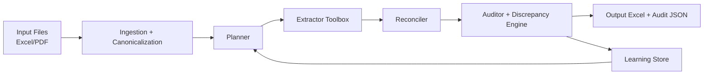
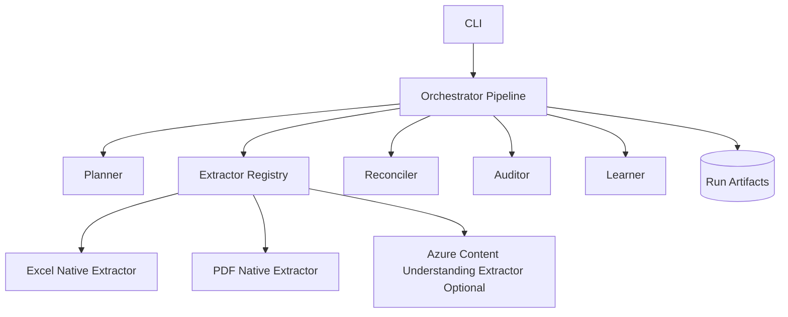

# Agentic Document Extraction Baseline (Python)

A starter template for an autonomous, self-learning document extraction pipeline.

This baseline is designed to be forked and customized. It focuses on:
- messy input documents (`.xlsx`, `.xls`, `.pdf`)
- one target output schema
- non-blocking extraction (always produce output)
- discrepancy reporting against optional ground truth
- continuous learning hooks
- optional Azure Content Understanding integration

## Goals

- Run on demand for a folder of input documents.
- Dynamically choose extractors per file type.
- Populate a single output schema (including `not_found` markers when missing).
- Never hard fail on extraction quality issues.
- Always emit an audit summary and discrepancy report.

## High-Level Flow



## Component Diagram



## Project Structure

```text
src/doc_extract_agentic/
  cli.py
  config.py
  models.py
  pipeline.py
  planner.py
  reconciler.py
  auditor.py
  learner.py
  io_utils.py
  extractors/
    base.py
    registry.py
    excel_native.py
    pdf_native.py
    azure_content_understanding.py
configs/
  default.yaml
schemas/
  output_schema.example.json
docs/
  architecture.md
```

## Quick Start

1. Create environment and install:

```bash
python -m venv .venv
.venv\Scripts\activate
pip install -e .
```

2. Prepare inputs:
- put input files into a folder (Excel/PDF)
- adjust schema in `schemas/output_schema.example.json`
- adjust aliases and extractor config in `configs/default.yaml`

3. Run pipeline:

```bash
doc-extract-run \
  --input-dir ./sample_inputs \
  --output-dir ./runs/run_001 \
  --schema ./schemas/output_schema.example.json \
  --config ./configs/default.yaml
```

4. Optional evaluation against ground truth:

```bash
doc-extract-run \
  --input-dir ./sample_inputs \
  --output-dir ./runs/run_eval \
  --schema ./schemas/output_schema.example.json \
  --config ./configs/default.yaml \
  --ground-truth ./sample_ground_truth/output.xlsx
```

## What To Customize First

- `schemas/output_schema.example.json`: your real target fields.
- `configs/default.yaml`: field aliases, confidence thresholds, Azure CU mode.
- `extractors/*.py`: domain-specific extraction logic.
- `reconciler.py`: business rules for candidate selection.
- `auditor.py`: discrepancy and summary format for your stakeholders.

## Azure Content Understanding (Optional)

The template includes an optional CU extractor behind config flags:
- enabled/disabled switch
- mode: `fallback_only` or `assistive`

This keeps Azure integration optional while enabling easy adoption.

## Notes

- This template is a baseline, not a production-ready system.
- Start with deterministic extraction + audit loops, then add advanced learning policies.
