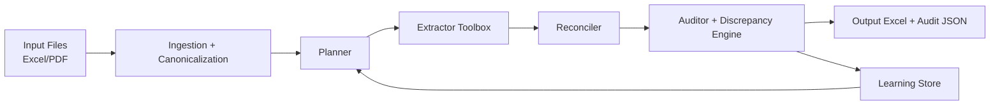
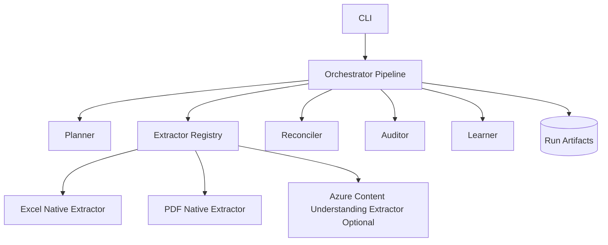

# Agentic Document Extraction Baseline (Python)

A **data-first, self-learning** document extraction pipeline designed to discover what's in your data and optimize extractors around it.

This baseline is designed to be forked and customized. It focuses on:
- **Data-driven approach**: Discover patterns in actual documents, not assumptions
- messy input documents (`.xlsx`, `.xls`, `.pdf`)
- one target output schema (or auto-generate from discovered data)
- non-blocking extraction (always produce output)
- discrepancy reporting against optional ground truth
- **continuous learning loops** for all extractors (Excel, PDF, and optional Azure CU)
- optional Azure Content Understanding integration

## Goals

- **Discover what's in your documents** before defining extraction rules
- Run on demand for a folder of input documents
- Dynamically choose extractors per file type based on performance
- Populate a single output schema (including `not_found` markers when missing)
- Never hard fail on extraction quality issues
- Always emit an audit summary and discrepancy report
- **Support continuous improvement**: analyze extraction performance, suggest improvements, and rerun to validate
- **Learn from all extractors** (Excel, PDF, CU) which strategies work best for your specific data

## High-Level Flow



## Component Diagram



## Project Structure

```text
src/doc_extract_agentic/
  cli.py
  config.py
  models.py
  pipeline.py
  planner.py
  reconciler.py
  auditor.py
  learner.py
  io_utils.py
  extractors/
    base.py
    registry.py
    excel_native.py
    pdf_native.py
    azure_content_understanding.py
configs/
  default.yaml
schemas/
  output_schema.example.json
docs/
  architecture.md
```

## Quick Start: Data-First Workflow

### Step 0: Discover What's In Your Data

Start by **analyzing your actual documents** before writing extraction rules:

```bash
# Scan your documents to see what fields/patterns exist
analyze-data --input-dir ./invoices
```

**Output**: Reports showing:
- What fields were discovered
- How often each field appears
- Example values
- Data types detected

This is your **ground truth**—what the system should actually find.

### Step 1: Extract with Learning

Now that you know what's in the data, run extraction:

```bash
python -m venv .venv
.venv\Scripts\activate
pip install -e .

doc-extract-run \
  --input-dir ./invoices \
  --output-dir ./runs/v1 \
  --schema ./schemas/output_schema.example.json \
  --config ./configs/default.yaml
```

**Output**: 
- `extracted_output.xlsx`: Your extracted data
- `learning_events.jsonl`: Detailed logs of what each extractor found
- `audit_summary.json`: Quality metrics

### Step 2: Analyze Extractor Performance

See which extractors work best for your specific data:

```bash
analyze-data --input-dir ./invoices --run-dir ./runs/v1
```

**Output**: Performance report showing:
- Success rate for each field (e.g., invoice_number: 85%)
- Which extractors work best (e.g., Excel > PDF for invoice_number)
- What needs improvement (e.g., vendor_name: 60%, needs work)
- Specific suggestions (add aliases, switch extractors, etc.)

### Step 3: Improve and Iterate

Based on the analysis, improve your extraction:

1. **Add missing aliases** to schema (from discovered field labels)
2. **Switch extractors** for fields where another performs better
3. **Add custom logic** for fields that remain problematic

Then rerun:

```bash
doc-extract-run --input-dir ./invoices --output-dir ./runs/v2 ...
analyze-data --input-dir ./invoices --run-dir ./runs/v2

# Compare success rates - should see improvement!
```

Repeat until extraction quality is satisfactory.

---

## Data-First Approach

This system is **data-first, not schema-first**. That means:

**Traditional (Schema-First):**
```
Define schema → Build extractors → Run → Hope it works
```

**This System (Data-First):**
```
Scan documents → Discover patterns → Optimize extractors → Validate → Iterate
```

**Why data-first?**
- You're not guessing at what fields exist—you're discovering them
- Extractors are optimized for YOUR specific data patterns
- Success rates improve measurably with each iteration
- No pre-built assumptions—system learns from your documents

**Example:**
You think your invoices have a "vendor_name" field. After scanning 20 real invoices:
- 18 use "Vendor Name"
- 2 use "Company Name"  
- 1 uses "Bill From"

The system discovers this, suggests adding those aliases, and extraction improves from 60% → 85%+.

See [docs/data-first-extraction.md](docs/data-first-extraction.md) for complete guide.

## What To Customize First

1. **Run `analyze-data`** to discover what's in your documents
2. Create/refine schema based on discovered fields
3. Tune aliases and extractor priorities based on performance analysis
4. Add custom extraction logic for fields that remain problematic
5. Iterate: rerun extract → analyze → improve → repeat

---

## Full Workflow: Traditional Quick Start

## CLI Commands Reference

| Command | Purpose |
|---------|---------|
| **`analyze-data`** | **📊 START HERE**: Discover what's in your documents, analyze extractor performance |
| `doc-extract-run` | Extract data from documents using configured extractors |
| `analyze-cu` | Analyze Azure CU performance vs other extractors (if using CU) |
| `improve-cu` | Apply improvements and rerun extraction (if using CU) |
| `setup-cu-analyzer` | Generate extraction prompt from schema (if using CU) |
| `test-cu-config` | Validate Azure CU configuration (if using CU) |
| `setup-env` | Configure Azure credentials (if using CU) |

**Most common workflow:**
```bash
analyze-data --input-dir ./docs                    # Discover patterns
doc-extract-run --input-dir ./docs --output-dir ./runs/v1 ...
analyze-data --input-dir ./docs --run-dir ./runs/v1  # See performance
# Update config/schema based on suggestions
doc-extract-run --input-dir ./docs --output-dir ./runs/v2 ...
analyze-data --input-dir ./docs --run-dir ./runs/v2  # Measure improvement
```

## Continuous Improvement (Feedback Loop)

The baseline includes **autonomous feedback loops** for all extractors:

### For Excel/PDF Extraction (Native Extractors)

```bash
# Analyze which extractors work best for your data
analyze-data --input-dir ./invoices --run-dir ./runs/v1

# Review output to see:
# - Success rates per field
# - Which extractors perform best
# - Specific improvement suggestions
```

**Improvements you can make:**
1. Add aliases for commonly used field labels
2. Switch extractor priority (e.g., use PDF for total_amount)
3. Add custom extraction logic for specific fields

### For Azure Content Understanding (Optional)

If using CU as a fallback or assistive extractor:

```bash
# See where CU wins/loses vs other extractors
analyze-cu \
  --run-dir ./runs/run_001 \
  --schema ./schemas/output_schema.example.json \
  --config ./configs/default.yaml

# Apply improvements and rerun
improve-cu \
  --previous-run ./runs/run_001 \
  --input-dir ./sample_inputs \
  --schema ./schemas/output_schema.example.json \
  --config ./configs/default.yaml \
  --new-run ./runs/run_002_improved
```

See [docs/cu-feedback-loop.md](docs/cu-feedback-loop.md) for detailed CU workflow.

### Typical 3-Day Improvement Cycle

**Day 1**: Discover & Baseline
```bash
analyze-data --input-dir ./invoices
# Learn: 18 fields discovered, vendor_name only 60% success

doc-extract-run --input-dir ./invoices --output-dir ./runs/v1 ...
analyze-data --input-dir ./invoices --run-dir ./runs/v1
```

**Day 2**: First Optimization
```bash
# Update schema with discovered aliases, switch to PDF for some fields
# Edit configs/default.yaml and schemas/output_schema.example.json

doc-extract-run --input-dir ./invoices --output-dir ./runs/v2 ...
analyze-data --input-dir ./invoices --run-dir ./runs/v2
# Result: vendor_name jumps from 60% → 80%
```

**Day 3**: Fine-Tuning
```bash
# Add custom extraction logic, adjust field thresholds

doc-extract-run --input-dir ./invoices --output-dir ./runs/v3 ...
analyze-data --input-dir ./invoices --run-dir ./runs/v3
# Result: vendor_name now at 92%, all fields > 85%
```

See [docs/data-first-extraction.md](docs/data-first-extraction.md) for complete data-first patterns.

## Azure Content Understanding (Optional)

The template includes an optional CU extractor behind config flags:
- enabled/disabled switch
- mode: `fallback_only` or `assistive`

This keeps Azure integration optional while enabling easy adoption.

**Setup Azure CU:**
1. Create a Document Intelligence resource in Azure Portal
2. Add endpoint and API key to `configs/default.yaml` or environment variables
3. Run setup script: `python -m doc_extract_agentic.scripts.setup_cu_analyzer --schema ./schemas/output_schema.example.json --config ./configs/default.yaml`
4. Enable in config: set `azure_content_understanding.enabled: true`

See [docs/azure-cu-setup.md](docs/azure-cu-setup.md) for detailed instructions.

## Notes

- This template is a baseline, not a production-ready system.
- Start with deterministic extraction + audit loops, then add advanced learning policies.
