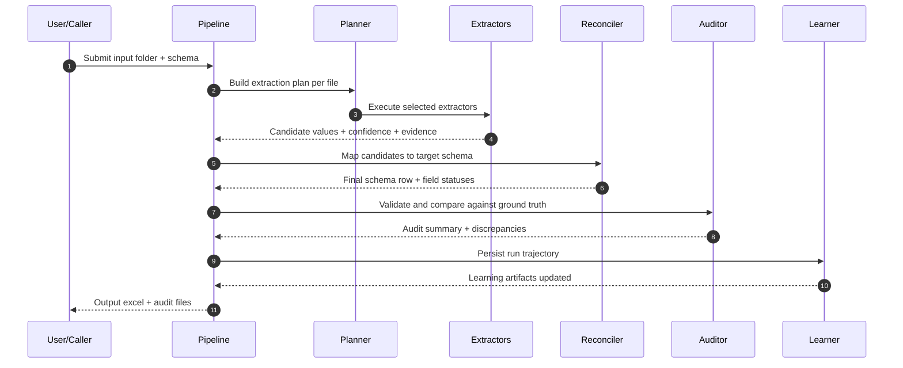

# Architecture Details

## Design Principles

1. Always emit output.
2. Keep one strict target schema.
3. Track evidence and confidence for each field.
4. Use extractor ensembles, not a single model.
5. Learn continuously from discrepancies and corrections.

## Execution Stages

## Output Artifacts

Per run, the pipeline emits:
- `extracted_output.xlsx`: normalized output rows
- `audit_summary.json`: high-level quality and counts
- `discrepancies.csv`: expected vs actual (if ground truth provided)
- `run_trace.json`: plan decisions and selected extractors
- `learning_events.jsonl`: append-only learning records

## Extractor Ensemble

Current baseline extractors:
- llm_native for spreadsheet reasoning with few-shot examples
- excel_native as deterministic fallback for spreadsheets
- pdf_native for colon-delimited key-value parsing in PDF text

The reconciliation layer maps extractor candidates into one strict output schema.
