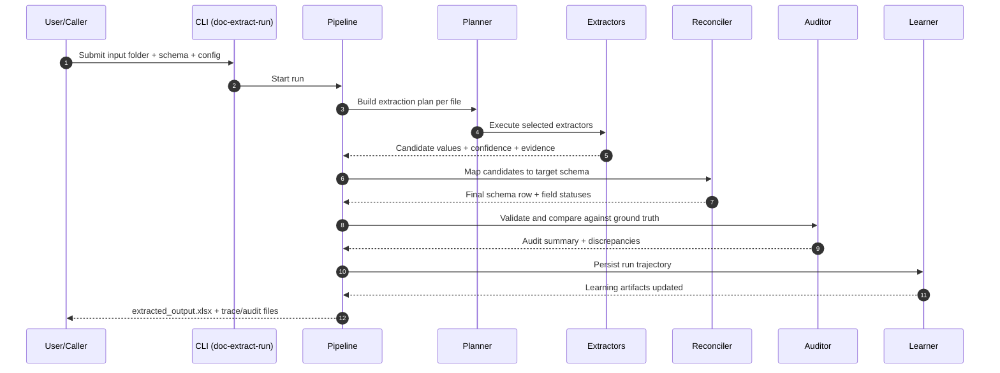
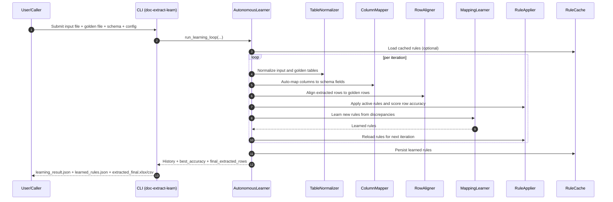

# Architecture Details

## Design Principles

1. Always emit output.
2. Keep one strict target schema.
3. Track evidence and confidence for each field.
4. Use extractor ensembles, not a single model.
5. Learn continuously from discrepancies and corrections.

## Primary Commands

1. `doc-extract-run`: batch extraction from an input directory into normalized output artifacts.
2. `doc-extract-learn`: iterative rule learning from one input file and one golden file, with persistent rule caching.

`doc-extract-auto-iterate` remains available as an optional advanced/legacy workflow and is not required for the primary run/learn path.

## doc-extract-run Flow

## doc-extract-learn Flow

## Output Artifacts

`doc-extract-run` emits:
- `extracted_output.xlsx`: normalized output rows
- `audit_summary.json`: high-level quality and counts
- `discrepancies.csv`: expected vs actual (if ground truth provided)
- `run_trace.json`: plan decisions and selected extractors
- `learning_events.jsonl`: append-only learning records

`doc-extract-learn` emits:
- `learning_result.json`: iteration history and final accuracy summary
- `learned_rules.json`: learned rule set
- `extracted_final.xlsx`: final learned extraction output
- `extracted_final.csv`: final learned extraction output (CSV)

## Extractor Ensemble

Current baseline extractors:
- llm_native for spreadsheet reasoning with few-shot examples
- excel_native as deterministic extraction for spreadsheets (including all-rows extraction path)
- pdf_native for colon-delimited key-value parsing in PDF text (optional path)

The reconciliation layer maps extractor candidates into one strict output schema.

## Learning Components

`doc-extract-learn` composes these components:
- `table_normalizer`: canonicalizes input and golden tables for alignment
- `column_mapper`: discovers deterministic source-column to schema-field mappings
- `row_aligner`: matches extracted rows to golden rows and summarizes discrepancies
- `mapping_learner`: uses local LLM to propose transformation rules
- `rule_applier`: applies learned rules and row filtering gates
- `rule_cache`: persists reusable rules across runs for schema-compatible inputs
